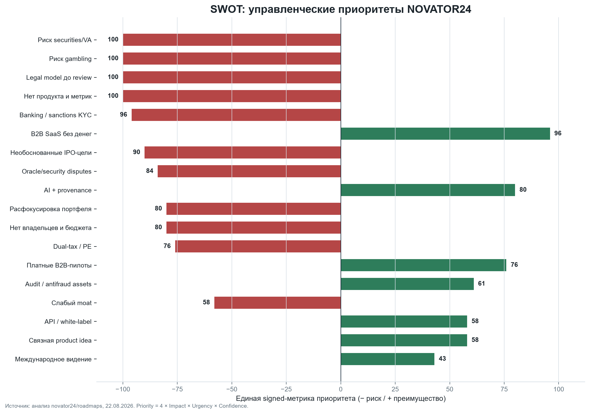
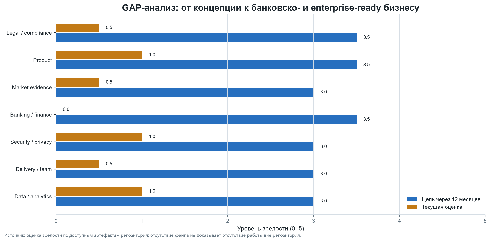
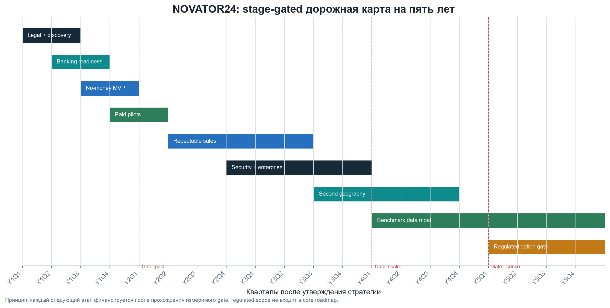
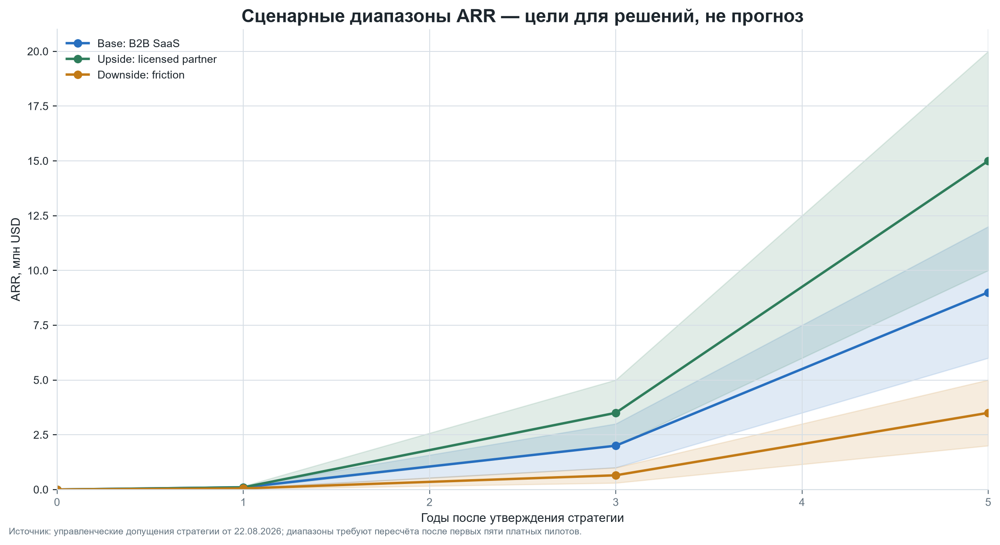

# NOVATOR24: стратегия компании на 1, 3 и 5 лет

**Версия:** 1.0  
**Дата:** 22 августа 2026 года  
**Основание:** анализ репозитория `novator24/roadmaps`, официальных источников ОАЭ и Гонконга и сценарное моделирование  
**Статус:** рабочая стратегия для стратегической сессии, а не юридическое, налоговое или инвестиционное заключение

> **Главный вывод.** Репозиторий описывает амбициозную платформу рынков предсказаний, но пока подтверждает только наличие концепции и планов, а не работающего продукта, пользователей или выручки. Запуск рынка с денежными ставками, собственного токена, токенизированных акций или хранения средств нельзя считать допустимым «MVP»: в Гонконге неразрешённые азартные игры запрещены, в ОАЭ коммерческий гейминг требует лицензии GCGRA, а торговля токенами и токенизированными ценными бумагами может потребовать лицензий SFC. Поэтому рекомендуемая стратегия — сначала **B2B SaaS для прогнозирования и принятия решений без денежных ставок и кастодиального хранения**, а регулируемый продукт оставить как опцион после письменного заключения юристов и партнёрства с лицензированным оператором.

## 0. Резюме для основателя

### Предлагаемая миссия

**Помогать командам принимать проверяемые решения в условиях неопределённости, превращая коллективные прогнозы и открытые данные в прозрачные, аудируемые сигналы — без хранения клиентских средств и без нелицензированных ставок.**

### Видение на пять лет

NOVATOR24 — доверенная B2B-платформа организационного прогнозирования для компаний MENA и APAC: сценарии, вероятностные оценки, репутация прогнозистов, AI-аналитика, доказуемое происхождение данных и API для корпоративных систем.

### Стратегический выбор

1. **Основной продукт:** приватные рынки прогнозов/опросы вероятностей для бизнеса, где участники получают очки и репутацию, а не деньги.
2. **Покупатель:** руководители стратегии, рисков, финансов, продукта и supply chain в компаниях на 100–5 000 сотрудников.
3. **Первая вертикаль:** fintech/e-commerce/logistics в ОАЭ; вторая — профессиональные услуги и торговые компании Гонконга.
4. **Монетизация:** подписка B2B, внедрение, API и аналитические отчёты.
5. **Юридический контур:** резидентство и фриланс-лицензия основателя в ОАЭ — для законной личной деятельности; отдельная Hong Kong Ltd — для IP, B2B-контрактов и азиатских продаж. Счета, договоры и бухгалтерия двух лиц не смешиваются.
6. **Красные линии:** до письменного regulatory memo не запускать денежные ставки, депозиты/вывод, собственную биржу, обмен токена на акции, публичную продажу токена и маркетинг «доходности».
7. **Финансовая логика:** сначала 5 платных пилотов и подтверждённый retention, затем команда и географическое масштабирование. IPO в 2027 году исключается из базового плана как не подтверждённая метриками цель.

### Целевой результат по горизонтам

| Горизонт | Стратегическая цель | Контрольный результат |
|---|---|---|
| 1 год: доказательство | Легальная структура, банковская готовность, product–problem fit | 5 платных пилотов, ARR ≥ $100 тыс., 2 юрзаключения, 0 денежных ставок |
| 3 года: масштабирование | Повторяемые продажи в двух регионах | 40 B2B-клиентов, ARR ≥ $2 млн, валовая маржа ≥ 70%, NRR ≥ 105% |
| 5 лет: категория | Региональный лидер decision intelligence | 150 клиентов, ARR ≥ $10 млн, положительная EBITDA, 3 региона |

## 1. Что фактически найдено в репозитории

### Подтверждённые факты

- Это документационный planning hub: в нём 43 файла, преимущественно Markdown, и нет `.sol`, `package.json`, Dockerfile, CI-конфигурации или deployable frontend/backend.
- Локальный `origin` указывает на `https://github.com/polyros/roadmaps.git`, хотя в задании репозиторий назван `novator24/roadmaps`; это расхождение владельца следует уточнить до оформления IP и договоров.
- Корневой `README.md` описывает мультиюрисдикционную платформу рынков предсказаний на блокчейне с AI, оракулами и целями для России, Китая, ОАЭ и СНГ.
- В `task_2025_10_31/README.md` задан MVP с торговым движком, escrow, кошельками, KYC, рынками и выплатами.
- В `task_2025_11_30/README.md` запланированы пополнение/вывод, банковские API, цифровой рубль, карты и криптовалюты.
- В `task_2025_12_31/README.md` описаны аукционы, antifraud, арбитраж и репутация.
- В `task_2026_10_31/README.md` предусмотрены аудит, неизменяемые журналы, отчётность и восстановление.
- В `task_2027_10_31/README.md` предусмотрены чаты, сообщества, геймификация и обучение.
- Папки `freelance`, `investments`, `trading`, `datalake`, `clockify` и `SOLIDITY.md` добавляют идеи по оплате фрилансеров в DAI, токенизации акций, покупке BTC, сбору сигналов из соцсетей, учёту времени и NFT.
- Sprint 1 за октябрь 2025 года фиксирует начальный backend-прототип, Airtable-смету, частичный перенос на Meteor и сокращение MVP до сайта; мобильную разработку планировалось передать `strongteam.tech`.
- Sprint backlog содержал 27 story points и 12 задач, но Definition of Done в репозитории не отмечен выполненным; тестовый стенд, Figma, Sentry и CI/CD оставались блокерами.

### Что репозиторий не подтверждает

- Нет доказательств работающего production-продукта, deployable кода в этом репозитории, независимого security-аудита или лицензии. Упомянутый в Sprint 1 прототип, вероятно, находится во внешнем репозитории или среде и в рамках этого анализа не верифицирован.
- Нет верифицируемых данных о пользователях, MAU, retention, GMV, выручке, CAC, LTV или банковских партнёрах.
- Не определены юридические лица, владельцы IP, ответственные руководители, бюджет и доступная команда.
- Цели «1,5 млн пользователей», «$100 млн GMV» и IPO с оценкой $500 млн–$1 млрд не имеют расчётной воронки и подтверждения рынком.
- Несколько требований выглядят как предположения: доступ к API цифрового рубля, Masterchain, автоматическая «100% compliance», точность antifraud 99% до появления обучающей выборки.

### Вывод о зрелости

Текущая стадия — **pre-seed / концепция с ранним прототипированием**. Сильная сторона — широкий набор продуктовых и технических гипотез и первые операционные артефакты Sprint 1. Главный разрыв — отсутствие проверяемой последовательности «право → клиентская проблема → платный пилот → продукт → масштабирование».

## 2. Архитектура стратегической сессии

### Этап 1. Подготовка

#### 1a. Определение целей сессии

За один рабочий день принять пять решений:

1. какой нерегулируемый B2B use case запускается первым;
2. кто покупатель и какую измеримую проблему он решает;
3. когда действительно нужна Hong Kong Ltd;
4. какие действия запрещены до юридического заключения;
5. какие метрики через 90 и 365 дней означают «продолжать», «изменить» или «остановить».

#### 1b. Сбор данных

До сессии подготовить:

- список навыков, доступного времени и капитала основателя;
- 20 интервью с потенциальными покупателями;
- письменный pre-assessment от двух банков/платёжных провайдеров по KYC-пакету;
- memo юриста ОАЭ и юриста Гонконга по продукту, данным, рекламе, геймингу, virtual assets и securities;
- карту российского, ОАЭ и гонконгского налогового резидентства основателя;
- прототип без денег и результаты пяти usability-тестов;
- реестр всех допущений из репозитория с источником и владельцем проверки.

#### 1c. Участники

| Роль | Обязательный вклад |
|---|---|
| Основатель / CEO | выбор рынка, бюджет, риск-аппетит |
| Product lead | интервью, use case, roadmap |
| Tech lead | архитектура, оценка сроков, безопасность |
| Юрист ОАЭ | лицензия фрилансера, gaming/VA, договоры |
| Юрист Гонконга | incorporation, gambling, SFC, privacy |
| Налоговый консультант | резидентство, PE, transfer pricing |
| Compliance / MLRO adviser | KYC, санкции, source of funds |
| 2 потенциальных клиента | проверка ценности и процесса закупки |

**Выход этапа:** подписанный decision log, список red lines, 90-дневный backlog и бюджет.

## 3. Анализ текущего состояния

### 3.1 SWOT и единая метрика приоритета

Все факторы измеряются одной шкалой:

**Priority = round(4 × Impact × Urgency × Confidence),** где Impact и Urgency — от 1 до 5, Confidence — от 0,50 до 1,00. Итог — от 1 до 100. Для карты влияния сильные стороны и возможности имеют знак «+», слабости и угрозы — знак «−». Приоритет показывает порядок управленческого внимания, а не вероятность финансового результата.

| Код | Тип | Фактор | Impact | Urgency | Confidence | Priority / 100 | Знак |
|---|---|---|---:|---:|---:|---:|---:|
| W1 | Weakness | Нет подтверждённого продукта, клиентов и метрик | 5 | 5 | 1,00 | 100 | −100 |
| W2 | Weakness | План исходит из допустимости ставок и платежей до legal review | 5 | 5 | 1,00 | 100 | −100 |
| T1 | Threat | Нелицензированные рынки могут квалифицироваться как gambling | 5 | 5 | 1,00 | 100 | −100 |
| T2 | Threat | Токенизированные акции/биржа могут потребовать лицензий | 5 | 5 | 1,00 | 100 | −100 |
| O1 | Opportunity | B2B forecasting без денег сохраняет ядро ценности | 5 | 5 | 0,96 | 96 | +96 |
| T3 | Threat | Усиленный KYC/санкционный screening и банковский de-risking | 5 | 5 | 0,96 | 96 | −96 |
| W3 | Weakness | IPO и финансовые цели не связаны с воронкой и unit economics | 5 | 5 | 0,90 | 90 | −90 |
| W4 | Weakness | Не назначены владельцы, бюджет и фактическая команда | 5 | 4 | 1,00 | 80 | −80 |
| O2 | Opportunity | AI-сводка прогнозов и доказуемое происхождение данных | 5 | 4 | 1,00 | 80 | +80 |
| T4 | Threat | Ошибки оракулов, безопасность и споры подрывают доверие | 5 | 4 | 0,84 | 84 | −84 |
| W5 | Weakness | Расфокусировка: ставки, NFT, акции, BTC, фриланс, datalake | 4 | 5 | 1,00 | 80 | −80 |
| O3 | Opportunity | Платные пилоты для risk/strategy команд в MENA и APAC | 4 | 5 | 0,95 | 76 | +76 |
| T5 | Threat | Налоговое присутствие и управление HK-компанией из ОАЭ | 4 | 5 | 0,95 | 76 | −76 |
| S1 | Strength | Продуманы аудит, журналы, antifraud и роли системы | 4 | 4 | 0,95 | 61 | +61 |
| S2 | Strength | Есть связная продуктовая идея: прогнозы, оракулы, репутация | 4 | 4 | 0,90 | 58 | +58 |
| O4 | Opportunity | API прогнозов и white-label для корпоративных платформ | 4 | 4 | 0,90 | 58 | +58 |
| T6 | Threat | Низкий moat до появления данных, интеграций и workflow lock-in | 4 | 4 | 0,90 | 58 | −58 |
| S3 | Strength | Международное видение и ориентация на прозрачность | 3 | 4 | 0,90 | 43 | +43 |

**Интерпретация:** первые деньги и время должны идти не на blockchain/token/IPO, а на снятие W1/W2, использование O1 и контроль T1–T3.

### 3.2 STEP / PESTEL

| Фактор | Влияние | Что это значит для стратегии |
|---|---:|---|
| Political / sanctions | Очень высокое | Национальность сама по себе не равна запрету, но банки проверяют санкции, происхождение средств, контрагентов и корреспондентские риски |
| Economic | Высокое | ОАЭ и Гонконг удобны как хабы, но два контура создают расходы на аудит, секретаря, налоги, transfer pricing и банки |
| Social | Среднее | Термин «рынок предсказаний» может восприниматься как азартная игра; B2B «decision intelligence» снижает барьер |
| Technological | Высокое | AI и event-driven архитектура доступны; blockchain нужен только при доказанной выгоде аудита, не как исходная цель |
| Environmental | Низкое/среднее | Cloud footprint важен для enterprise procurement, но не определяет первый product–market fit |
| Legal | Критическое | Gambling, securities, virtual assets, privacy, AML и реклама формируют границы продукта до написания кода |

### 3.3 Пять сил Портера

Шкала: 1 — слабое давление, 5 — сильное.

| Сила | Балл | Обоснование | Ответ |
|---|---:|---|---|
| Конкуренция | 4 | Есть опросные, BI, risk и forecasting-инструменты | Фокус на workflow + audit trail + региональные интеграции |
| Новые игроки | 4 | Прототип на AI собрать легко | Накапливать benchmark data, интеграции и доверие |
| Сила покупателей | 4 | Enterprise может долго закупать и требовать кастомизацию | Узкий ICP, пакетированный пилот, годовые контракты |
| Сила поставщиков | 3 | LLM/cloud/data APIs заменяемы, но могут дорожать | Multi-provider abstraction, контроль COGS |
| Заменители | 5 | Excel, формы, Slack, консалтинг и внутренние BI | Доказывать сокращение времени решения и calibration uplift |

**Вывод:** привлекательность отрасли средняя; преимущество создаётся не торговым движком, а внедрённым процессом решений и проверяемым эффектом.

### 3.4 Value Chain Analysis

| Звено | Ценность | KPI | Build / buy |
|---|---|---|---|
| Customer discovery | точная задача и ICP | 40 интервью/год | Build |
| Data ingestion | факты и контекст событий | freshness, source coverage | Build connectors |
| Forecast workflow | сбор вероятностей и аргументов | participation, time-to-forecast | Build core |
| Aggregation / AI | консенсус, сценарии, summary | Brier score, analyst time saved | Build core |
| Audit / provenance | доверие и разбор решений | % событий с evidence trail | Build core |
| Delivery | dashboards, reports, API | weekly active teams | Build |
| Billing / identity | безопасная операция | collection rate, SSO adoption | Buy/integrate |
| Legal / security | доступ к enterprise | audit findings, incidents | Partner + internal owner |

### 3.5 GAP-анализ

Шкала зрелости 0–5; текущая оценка основана на артефактах репозитория, а не на самооценке.

| Способность | Сейчас | Цель через год | Ключевой разрыв |
|---|---:|---:|---|
| Legal / compliance | 0,5 | 3,5 | Нет письменной квалификации продукта и red lines |
| Product | 1,0 | 3,5 | Есть ТЗ, нет подтверждённого MVP и usage |
| Market evidence | 0,5 | 3,0 | Нет интервью, LOI и платных пилотов |
| Banking / finance ops | 0,0 | 3,5 | Нет счёта, KYC data room, учёта двух контуров |
| Security / privacy | 1,0 | 3,0 | Есть идеи, нет threat model, controls и тестов |
| Delivery / team | 0,5 | 3,0 | Роли описаны, люди и capacity не подтверждены |
| Data / analytics | 1,0 | 3,0 | Есть идеи оракулов, нет source registry и calibration |

### 3.6 Портфельный анализ GE/McKinsey

| Инициатива | Привлекательность рынка / 5 | Сила компании / 5 | Решение |
|---|---:|---:|---|
| B2B forecasting SaaS без денег | 4,4 | 2,2 | Инвестировать и доказать |
| Forecasting API / white-label | 4,0 | 1,8 | Строить после core MVP |
| Research/community с очками | 3,2 | 2,0 | Ограниченный эксперимент |
| Regulated event contracts | 2,5 | 0,5 | Опцион через лицензированного партнёра |
| Токенизация акций / exchange | 2,0 | 0,5 | Остановить до SFC/legal route |
| BTC treasury, NFT, DAI payroll | 2,2 | 1,0 | Вне core; не финансировать из runway |

### 3.7 ABC-анализ распределения ресурсов

| Класс | Доля ресурсов | Что входит |
|---|---:|---|
| A | 70% | legal memos, customer discovery, платные пилоты, core MVP, KYC data room, security baseline |
| B | 20% | API, интеграции, контент, community, аналитические шаблоны |
| C | 10% максимум | blockchain R&D, публичное сообщество, дальние рынки; NFT/IPO/token launch — 0% до gate |

### 3.8 Матрица Ансоффа

|  | Текущий рынок: UAE/HK B2B | Новый рынок |
|---|---|---|
| Текущий продукт | Проникновение: пакетированные пилоты и case studies | Развитие рынка: GCC и Singapore после repeatable sales |
| Новый продукт | Развитие продукта: API, scenario studio, benchmark data | Диверсификация: regulated contracts только через лицензию/партнёра |

### 3.9 ADL-анализ

Отрасль enterprise decision intelligence растёт, но конкретный продукт NOVATOR24 находится на **эмбриональной стадии** и имеет слабую конкурентную позицию. Предписанная ADL-стратегия: **селективные инвестиции, быстрые эксперименты, узкая ниша, запрет на капиталоёмкое масштабирование до подтверждения retention и willingness-to-pay**.

## 4. Формулирование стратегии

### 4.1 Product thesis

Компании регулярно ошибаются не из-за отсутствия данных, а потому что:

- оценки остаются в чатах и таблицах;
- уверенность не выражается вероятностью;
- мнение руководителя подавляет независимые оценки;
- после события невозможно понять, кто и почему был точен;
- нет цикла обучения на прошлых прогнозах.

NOVATOR24 превращает решение в повторяемый процесс: **вопрос → независимые прогнозы → аргументы и источники → агрегированная вероятность → сценарий → решение → факт → calibration review**.

### 4.2 Продуктовые границы первой версии

**Входит:** приватные пространства, бинарные/числовые прогнозы, баллы, Brier score, роли, комментарии, evidence links, resolution workflow, audit log, CSV/API export, AI-summary.

**Не входит:** реальные деньги, депозиты, выводы, кошельки, обмен токенов, публичная биржа, обещание доходности, торговля акциями, custody, anonymous users.

### 4.3 Business model

| Тариф | Клиент | Цена-гипотеза | Содержание |
|---|---|---:|---|
| Pilot | 1 команда / 8 недель | $5–15 тыс. | 3 use cases, onboarding, итоговый ROI report |
| Team | 10–50 seats | $12–30 тыс. ARR | workflows, dashboards, exports |
| Enterprise | 50+ seats | $50–150 тыс. ARR | SSO, API, controls, SLA, private deployment |
| Services | enterprise | $10–40 тыс. | design of forecasting process, integrations |

Цены — гипотезы для интервью и пилотов, не обещание выручки.

### 4.4 BSC — сбалансированная система показателей

| Перспектива | Цель | KPI через 1 год | KPI через 3 года | KPI через 5 лет |
|---|---|---:|---:|---:|
| Финансы | устойчивый recurring revenue | ARR $100k; burn ≤ $250k | ARR $2m; GM ≥ 70% | ARR $10m; EBITDA ≥ 15% |
| Клиенты | доказанная ценность | 5 paid pilots; NPS ≥ 30 | 40 клиентов; NRR ≥ 105% | 150 клиентов; NRR ≥ 110% |
| Процессы | надёжная доставка | 99,5% uptime; 0 Sev-1 | 99,9%; release weekly | 99,95%; multi-region |
| Обучение | data moat и команда | 3 core FTE; 100 resolved questions | benchmark dataset; 12–18 FTE | 35–55 FTE; partner academy |
| Compliance | право как product gate | 2 memos; red-line register | annual audit; security attestation | 0 material breaches; mature GRC |

### 4.5 SMART-цели

#### На 12 месяцев

1. До 31 октября 2026 года получить письменные заключения ОАЭ и Гонконга о B2B-модели и отдельно о запрещённых функциях.
2. До 31 декабря 2026 года провести 40 интервью, получить 10 LOI и выбрать один ICP/use case.
3. До 28 февраля 2027 года запустить MVP без денег у трёх design partners.
4. До 31 мая 2027 года конвертировать не менее трёх пилотов в оплату и измерить baseline/impact.
5. До 22 августа 2027 года иметь пять платных клиентов, ARR не менее $100 тыс., weekly active team rate ≥ 60% и runway ≥ 12 месяцев.

#### На 3 года

К 22 августа 2029 года: 40 B2B-клиентов, ARR ≥ $2 млн, валовая маржа ≥ 70%, NRR ≥ 105%, CAC payback ≤ 18 месяцев, не менее 60% выручки по подписке, две географии и ни одного материального regulatory breach.

#### На 5 лет

К 22 августа 2031 года: 150 B2B-клиентов, ARR ≥ $10 млн, EBITDA ≥ 15%, NRR ≥ 110%, три региона, не менее 1 млн разрешённых прогнозов в benchmark dataset и решение о регулируемом направлении только при наличии лицензии/лицензированного партнёра.

## 5. Юридическая и банковская операционная модель

### 5.1 Рекомендуемая последовательность

1. Определить фактическое налоговое резидентство основателя и обязанности в РФ, ОАЭ и иных странах.
2. Выбрать подходящую freelance/self-employment activity в ОАЭ; получить residence/Emirates ID, если это соответствует реальной деятельности и миграционному плану.
3. Собрать KYC data room: паспорт, адрес, CV, контракты, invoices, банковские выписки, source of wealth/funds, налоговые документы, описание клиентов и ожидаемых потоков.
4. Открыть отдельный счёт для фриланс-деятельности; не использовать личный счёт как операционный счёт HK Ltd.
5. До регистрации Hong Kong Ltd провести pre-clearance у company secretary, банка/EMI, аудитора и юриста по business description и UBO.
6. Зарегистрировать HK Ltd, назначить HK company secretary, registered office, вести Significant Controllers Register и отдельную бухгалтерию.
7. Подписать IP assignment и, если основатель оказывает услуги HK Ltd из ОАЭ, arm’s-length service agreement; проверить permanent establishment, corporate tax и transfer pricing.
8. Открывать корпоративный счёт HK Ltd на основании реальных договоров, сайта, business plan и понятных потоков. Регистрация компании не гарантирует открытия счёта.

### 5.2 Что важно по Гонконгу

- Нерезидент может быть директором; частной компании нужен как минимум один директор — физическое лицо.
- Секретарь-физлицо должен обычно проживать в Гонконге; корпоративный секретарь должен иметь registered office/place of business в Гонконге.
- Нужны registered office, Significant Controllers Register и designated representative.
- Частная компания подаёт NAR1 ежегодно в течение 42 дней после годовщины регистрации.
- Финансовая отчётность частной компании, как правило, ежегодно аудируется, даже если не подаётся вместе с NAR1; исключение — dormant company.
- Территориальный принцип не означает автоматическую «нулевую ставку»: источник прибыли определяется по фактам операций; offshore claim нужно обосновать.
- Двухуровневая ставка profits tax для подходящей корпорации: 8,25% на первые HK$2 млн assessable profits и 16,5% выше.

### 5.3 Что важно по ОАЭ

- Банк применяет risk-based CDD/KYC, проверяет UBO, source of funds, географии, контрагентов и санкционные списки. Российский паспорт сам по себе не является официальным blanket ban, но риск-профиль может вызвать enhanced due diligence.
- Для физлица business/freelance turnover свыше AED 1 млн за календарный год может включить Corporate Tax obligations.
- VAT-регистрация для резидентного бизнеса обязательна при taxable supplies/imports свыше AED 375 тыс. за предыдущие 12 месяцев или ожидаемом превышении в следующие 30 дней.
- Freelance permit, residence, tax residency и Tax Residency Certificate — разные правовые факты; один документ не доказывает остальные автоматически.

### 5.4 Banking-ready пакет

| Блок | Документы |
|---|---|
| Identity | паспорт, Emirates ID/residence, подтверждение адреса, CV |
| Ownership | incorporation docs, register of members/directors, UBO/SCR |
| Business | сайт, pitch, contracts/LOI, invoices, product screenshots |
| Flows | ожидаемый оборот, валюты, страны, средний чек, counterparties |
| Funds | source of wealth/funds, выписки, налоговые декларации, договоры |
| Compliance | sanctions statement, prohibited countries/activities, AML policy соразмерно риску |
| Governance | board resolutions, signatories, accounting/audit provider |

**Запрещённая практика:** маскировать российское происхождение средств, номинально описывать бизнес как «IT consulting», если фактически ведутся ставки/обмен, смешивать личные и корпоративные деньги или дробить платежи для обхода проверок.

## 6. План реализации

### 6.1 Год 1: доказательство, август 2026 — август 2027

| Период | Действие | Ответственный | Ресурс | Gate |
|---|---|---|---|---|
| 0–30 дней | legal map, tax residency map, red lines | CEO + counsel | $8–20k | 2 письменных memo |
| 0–45 дней | 20 интервью и ICP shortlist | CEO/Product | 120 часов | 3 повторяющиеся боли |
| 30–75 дней | UAE KYC data room и bank pre-assessment | CEO/CFO adviser | $2–8k | ≥ 2 провайдера рассмотрели пакет |
| 45–90 дней | ещё 20 интервью, prototype tests, 10 LOI | Product | 160 часов | willingness-to-pay подтверждён |
| 3–5 месяц | MVP без денег, threat model, privacy baseline | Tech/Product | $25–60k | 3 design partners live |
| 5–8 месяц | 5 платных пилотов и ROI measurement | Sales/Product | $15–35k | ≥ 3 конверсии |
| 8–12 месяц | повторяемый onboarding, API v1, annual plan | Team | $30–80k | ARR ≥ $100k |

**Бюджет года 1:** ориентир $120–250 тыс., включая юридические услуги, структуру, разработку, cloud, продажи и резерв. Инкорпорация и банковский счёт не считаются достижением product–market fit.

### 6.2 Годы 2–3: повторяемые продажи и масштабирование

- выбрать одну вертикаль с лучшими retention и deal cycle;
- нанять 2–3 sales/customer success только после повторяемой конверсии;
- выпустить SSO, role controls, data residency options, API и audit export;
- подготовить ISO 27001 или SOC 2 readiness в зависимости от покупателей;
- открыть второй рынок только после 15 клиентов и CAC payback ≤ 18 месяцев;
- построить channel partnerships с consultancies/risk advisers;
- ежегодно обновлять legal memo и sanctions risk assessment;
- regulated prediction product исследовать только как отдельный workstream без смешения бренда, данных и денег.

**Инвестиционный критерий:** внешний seed-раунд имеет смысл, если ARR ≥ $500 тыс., NRR ≥ 100%, минимум 10 клиентов и доказана воронка. Иначе приоритет — revenue financing и контролируемый burn.

### 6.3 Годы 4–5: категория и опцион регулируемого продукта

- стать system of record для forecast governance;
- развивать benchmark dataset и отраслевые calibration indices;
- расширить APAC/MENA через партнёров, не создавая юрлицо в каждой стране до revenue trigger;
- добавить private deployment и regulated-industry controls;
- рассмотреть M&A небольших data/connectors команд;
- провести board-level review: оставаться B2B SaaS, партнёриться с лицензированным оператором или подавать на лицензию.

### 6.4 Дорожная карта

## 7. Сценарный анализ внешней среды

Сценарии — не прогнозы, а диапазоны для решений.

| Сценарий | Вес для планирования | Год 1 | Год 3 | Год 5 | Триггер |
|---|---:|---|---|---|---|
| Base: B2B SaaS | 55% | 5 клиентов, ARR $0,1m | 30–50 клиентов, ARR $1–3m | 100–180, ARR $6–12m | retention и повторяемые продажи |
| Upside: licensed partner | 20% | консультации, без запуска | пилот через лицензированного партнёра | ARR $10–20m совокупно | письменное разрешение + partner economics |
| Downside: banking/reg friction | 25% | задержка счёта, contractor model | ARR $0,3–1m | ARR $2–5m | отказ банков, длинный procurement |

### Правила решений по сценарию

- Если два банка/EMI письменно не готовы рассматривать профиль, не маскировать его; упростить географии/контрагентов или выбрать прозрачную альтернативу.
- Если после 40 интервью меньше 10% готовы к платному пилоту, сменить use case.
- Если pilot-to-paid < 40%, не масштабировать команду продаж.
- Если weekly active team rate < 40% после 8 недель, переработать workflow до новых функций.
- Если юрист квалифицирует core flow как gambling/securities/VA service, удалить flow либо вынести в отдельный лицензируемый проект.

## 8. Мониторинг и контроль

### 8.1 KPI-дерево

| Уровень | KPI | Частота | Владелец | Порог реакции |
|---|---|---|---|---|
| North Star | число решений, улучшенных прогнозным workflow | ежемесячно | Product | < 5/клиент/мес. |
| Adoption | weekly active teams | еженедельно | CS | < 60% |
| Quality | Brier score / calibration uplift | ежемесячно | Data | нет улучшения 2 квартала |
| Revenue | ARR, NRR, gross margin | ежемесячно | CEO/Finance | NRR < 100% |
| Sales | qualified pipeline, win rate, cycle | еженедельно | Sales | coverage < 3× target |
| Reliability | uptime, Sev-1, MTTR | непрерывно | Tech | любой Sev-1 |
| Compliance | incidents, overdue reviews, bank queries | ежемесячно | Compliance owner | любой material breach |
| Runway | cash / net burn | ежемесячно | CEO | < 12 месяцев |

### 8.2 Ревизии

- **Еженедельно:** product/sales review на 45 минут.
- **Ежемесячно:** BSC dashboard, cash, risks, KYC/bank correspondence.
- **Ежеквартально:** стратегическая ревизия, SWOT priorities, scenario weights, kill/continue decisions.
- **Ежегодно:** legal/tax memo, security assessment, audited HK accounts, обновление five-year model.

### 8.3 Обратная связь

- интервью у каждого клиента на 2-й и 8-й неделе;
- анонимный опрос участников и отдельный разговор с economic buyer;
- журнал lost deals с причиной;
- post-mortem каждого resolved forecast;
- advisory board раз в квартал: клиент, юрист/compliance, отраслевой эксперт.

### 8.4 RACI для первого года

| Результат | CEO | Product | Tech | Counsel | Finance/Compliance |
|---|---|---|---|---|---|
| Миссия и ICP | A | R | C | C | C |
| Legal red lines | A | C | C | R | C |
| UAE/HK structure | A | I | I | R | R |
| MVP | C | A/R | R | C | C |
| Paid pilots | A | R | C | I | C |
| Security baseline | I | C | A/R | C | C |
| KPI dashboard | A | R | C | I | R |

R — выполняет, A — несёт конечную ответственность, C — консультирует, I — информируется.

## 9. Риск-регистр

| Риск | Вероятность | Влияние | Ранний индикатор | Митигация |
|---|---:|---:|---|---|
| Gambling/securities qualification | Высокая для исходной модели | Критическое | юрист видит wager/tradable claim | no-money MVP; counsel gate |
| Bank rejection / closure | Средняя/высокая | Критическое | повторные SoF запросы | полное раскрытие, 2–3 провайдера, чистые потоки |
| Sanctions/counterparty exposure | Средняя | Критическое | платёж через listed bank/entity | screening, country policy, no circumvention |
| Нет willingness-to-pay | Высокая | Высокое | LOI без бюджета | paid discovery, жёсткий pilot gate |
| Scope creep | Высокая | Высокое | NFT/token/payment задачи в sprint | portfolio board и 70/20/10 |
| Data/privacy incident | Средняя | Критическое | PII в prompts/logs | minimization, DPA, access control, IR plan |
| Founder key-person risk | Высокая | Высокое | все решения/доступы у одного лица | board cadence, delegated access, documentation |
| Dual-tax / PE dispute | Средняя | Высокое | HK income при фактическом UAE management | tax opinion, substance, transfer pricing |

## 10. Решения, которые нужно принять сейчас

1. Утвердить миссию и B2B no-money позиционирование.
2. Заморозить payment, tokenized shares, NFT и public trading workstreams.
3. Выделить $8–20 тыс. на два legal memo до разработки regulated features.
4. Провести 40 интервью и не регистрировать лишнюю структуру только ради «престижа».
5. Если HK Ltd всё же создаётся сейчас — заранее принять ежегодный аудит, secretary, SCR, NAR1 и отдельный корпоративный учёт.
6. Назначить одного compliance owner, даже при аутсорсе экспертов.
7. Пересмотреть стратегию через 90 дней на основании LOI, банковского pre-assessment и legal map.

## 11. Источники и ограничения

### Официальные источники

1. Hong Kong Companies Registry — Incorporation FAQ: https://www.cr.gov.hk/en/faq/local-company/incorporation.htm
2. Hong Kong Companies Registry — Directors and company secretary: https://www.cr.gov.hk/en/faq/local-company/directors-secretary.htm
3. Hong Kong Companies Registry — Significant Controllers Register: https://www.cr.gov.hk/en/legislation/scr/faq.htm
4. Hong Kong Companies Registry — Annual returns: https://www.cr.gov.hk/en/faq/local-company/annual-return.htm
5. Hong Kong Companies Registry — Accounts and audit: https://www.cr.gov.hk/en/faq/companies-ordinance/co-account-audit.htm
6. Hong Kong IRD — Territorial source principle: https://www.ird.gov.hk/eng/paf/bus%5Fpft%5Ftsp.htm
7. GovHK — Profits tax rates: https://www.gov.hk/en/residents/taxes/taxfiling/taxrates/profitsrates.htm
8. Hong Kong IRD — Business registration fee table: https://www.ird.gov.hk/eng/pdf/brfee_table.pdf
9. Hong Kong policy on gambling: https://www.hyab.gov.hk/en/policy_responsibilities/District_Community_and_Public_Relations/gambling.htm
10. Hong Kong SFC — Virtual asset trading platforms: https://www.sfc.hk/en/Welcome-to-the-Fintech-Contact-Point/Virtual-assets/Virtual-asset-trading-platforms-operators
11. Hong Kong Monetary Authority — Account opening: https://www.hkma.gov.hk/eng/smart-consumers/account-opening/
12. UAE CBUAE — CDD/KYC Guidance (6 November 2025): https://www.centralbank.ae/media/bj5prczk/guidance-for-lfis-on-customer-due-diligence-and-record-keeping-6-november-2025.pdf
13. UAE GCGRA — Licensing: https://www.gcgra.gov.ae/en/licensing/
14. UAE Federal Tax Authority — Natural persons and Corporate Tax: https://tax.gov.ae/Datafolder/Files/Guides/CT/Taxation%20of%20natural%20persons%20-%2025%2011%202023.pdf
15. UAE Federal Tax Authority — VAT registration: https://tax.gov.ae/en/services/vat.registration.aspx
16. OFAC — Russian Harmful Foreign Activities Sanctions: https://ofac.treasury.gov/sanctions-programs-and-country-information/russian-harmful-foreign-activities-sanctions

Источники проверены 22 августа 2026 года. Правила банков и квалификация продукта зависят от фактов, контрагентов, стран пользователей и структуры потоков; до транзакций нужны персональные заключения лицензированных специалистов.

### Иллюстрации

- Hong Kong Harbour Night 2019-06-11 — Benh LIEU SONG, CC BY-SA 4.0: https://commons.wikimedia.org/wiki/File:Hong_Kong_Harbour_Night_2019-06-11.jpg
- Dubai skylines (Pixabay 1536496) — Ronald Sagarino, CC0 1.0: https://commons.wikimedia.org/wiki/File:Dubai_skylines_(Pixabay_1536496).jpg

### Ограничения модели

- Финансовые значения — целевые диапазоны и сценарные допущения, а не оценка стоимости или обещание доходности.
- SWOT scores — управленческая приоритизация автора по доступным данным; их следует пересчитать на стратегической сессии.
- Репозиторий содержит преимущественно планы; отсутствие артефакта в репозитории не доказывает его отсутствие вне репозитория.
- Стратегия сознательно консервативна в regulated scope: стоимость ошибки там несоизмеримо выше стоимости отложенной функции.

---

**Рекомендуемое решение:** строить NOVATOR24 как B2B decision-intelligence SaaS; использовать ОАЭ как прозрачную базу основателя, Hong Kong Ltd — как отдельный корпоративный контур для реального азиатского бизнеса, а не как способ обойти банковские, санкционные, налоговые или лицензионные требования.
