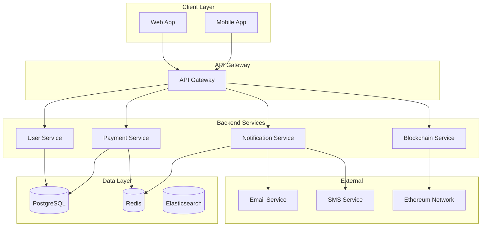

# Техническое задание: Разработка архитектуры системы

## Общая информация
- **Приоритет:** major
- **Оценка:** 5 SP
- **Исполнитель:** techlead
- **Срок выполнения:** 5 дней

## Цель
Определить общую архитектуру системы, включая взаимодействие между компонентами, выбор технологий и паттернов проектирования.

## Требования

### Функциональные требования
1. **Масштабируемость:** Система должна поддерживать до 10,000 одновременных пользователей
2. **Надежность:** Время безотказной работы 99.9%
3. **Безопасность:** Соответствие стандартам безопасности для финансовых приложений
4. **Производительность:** Время отклика API не более 200ms
5. **Интеграция:** Поддержка интеграции с блокчейн-сетью

### Нефункциональные требования
1. **Микросервисная архитектура:** Разделение на независимые сервисы
2. **Контейнеризация:** Использование Docker для всех компонентов
3. **Мониторинг:** Централизованное логирование и мониторинг
4. **CI/CD:** Автоматизированная сборка и деплой

## Архитектурные компоненты

### 1. Frontend Layer
- **Технологии:** React 18, TypeScript, Next.js 14
- **Состояние:** Redux Toolkit + RTK Query
- **UI:** Material-UI v5
- **Сборка:** Vite

### 2. API Gateway
- **Технологии:** Node.js, Express.js
- **Функции:** 
  - Маршрутизация запросов
  - Аутентификация и авторизация
  - Rate limiting
  - CORS настройки

### 3. Backend Services
- **User Service:** Управление пользователями
- **Payment Service:** Обработка платежей
- **Notification Service:** Отправка уведомлений
- **Blockchain Service:** Интеграция с блокчейном

### 4. Database Layer
- **Primary DB:** PostgreSQL 15
- **Cache:** Redis 7
- **Search:** Elasticsearch 8

### 5. Blockchain Integration
- **Network:** Ethereum Mainnet/Testnet
- **Web3 Library:** ethers.js v6
- **Smart Contracts:** Solidity 0.8.x

## Диаграмма архитектуры

## Технологический стек

### Backend
- **Runtime:** Node.js 20 LTS
- **Framework:** Express.js 4.18
- **ORM:** Prisma 5
- **Validation:** Zod
- **Testing:** Jest + Supertest

### Frontend
- **Framework:** React 18
- **Language:** TypeScript 5
- **Build Tool:** Vite 5
- **State Management:** Redux Toolkit
- **UI Library:** Material-UI v5

### DevOps
- **Containerization:** Docker + Docker Compose
- **Orchestration:** Kubernetes (опционально)
- **CI/CD:** GitHub Actions
- **Monitoring:** Prometheus + Grafana
- **Logging:** ELK Stack

### Blockchain
- **Network:** Ethereum
- **Language:** Solidity 0.8.x
- **Testing:** Hardhat
- **Deployment:** Foundry

## Паттерны проектирования

### 1. Microservices Pattern
- Разделение на независимые сервисы
- API-first подход
- Event-driven архитектура

### 2. CQRS (Command Query Responsibility Segregation)
- Разделение команд и запросов
- Оптимизация для чтения и записи

### 3. Event Sourcing
- Хранение событий вместо состояния
- Аудит и восстановление данных

### 4. Circuit Breaker
- Защита от каскадных сбоев
- Graceful degradation

## Безопасность

### 1. Аутентификация
- JWT токены с коротким временем жизни
- Refresh токены
- Multi-factor authentication (MFA)

### 2. Авторизация
- Role-based access control (RBAC)
- Resource-based permissions

### 3. Защита данных
- Шифрование данных в покое (AES-256)
- Шифрование данных в транзите (TLS 1.3)
- Hashing паролей (bcrypt)

### 4. API Security
- Rate limiting
- Input validation
- SQL injection protection
- XSS protection

## Мониторинг и логирование

### 1. Метрики
- Response time
- Throughput
- Error rate
- Resource utilization

### 2. Логирование
- Structured logging (JSON)
- Log levels (DEBUG, INFO, WARN, ERROR)
- Centralized logging

### 3. Алерты
- Critical error alerts
- Performance degradation alerts
- Security incident alerts

## Критерии приемки

### 1. Документация
- [ ] Архитектурная диаграмма создана
- [ ] API спецификация готова
- [ ] Database schema определена
- [ ] Deployment guide написан

### 2. Техническая реализация
- [ ] Базовые сервисы созданы
- [ ] API Gateway настроен
- [ ] Database connections работают
- [ ] Docker контейнеры настроены

### 3. Тестирование
- [ ] Unit тесты написаны (покрытие > 80%)
- [ ] Integration тесты работают
- [ ] Load testing проведен
- [ ] Security testing выполнен

## Риски и митигация

### Риски
1. **Сложность интеграции с блокчейном**
   - Митигация: Использование проверенных библиотек, тестирование на testnet

2. **Производительность базы данных**
   - Митигация: Индексы, кэширование, оптимизация запросов

3. **Безопасность**
   - Митигация: Security audit, penetration testing

## Deliverables

1. **Архитектурная документация**
   - System design document
   - API specification
   - Database schema

2. **Код**
   - Базовые сервисы
   - API Gateway
   - Docker configuration

3. **Инфраструктура**
   - Development environment
   - CI/CD pipeline
   - Monitoring setup

## Временные рамки

- **День 1-2:** Анализ требований, выбор технологий
- **День 3:** Создание архитектурной диаграммы
- **День 4:** Настройка базовой инфраструктуры
- **День 5:** Документация и code review
